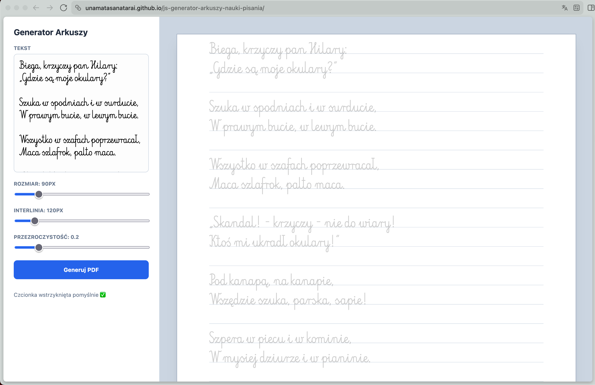

# Handwriting Worksheet Generator / Generator Arkuszy do Nauki Pisania

A professional, client-side web application designed to generate custom handwriting practice worksheets. Create high-resolution (300 DPI) PDF documents with dashed-style tracing text, fully customizable dimensions, and real-time preview.



## 🌐 Live Demo
Visit the live application here: [unamatasanatarai.github.io/js-generator-arkuszy-nauki-pisania/](https://unamatasanatarai.github.io/js-generator-arkuszy-nauki-pisania/)

---

## ✨ Features

-   **High Resolution:** Generates 300 DPI PDF files suitable for professional printing.
-   **Customizable Text:** Input any text (poems, names, sentences) for practice.
-   **Typography Control:** Adjust font size and line spacing to suit different ages or skill levels.
-   **Tracing Opacity:** Fine-tune the transparency of the dashed text for progressive learning.
-   **Automated Pagination:** Automatically handles multi-page PDF generation based on text length.
-   **Glassmorphic UI:** A modern, clean, and intuitive user interface.
-   **Client-Side Only:** No server processing required; all generation happens in your browser for maximum privacy.

## 🛠️ Built With

-   **Vanilla JavaScript (ES6+):** Pure logic without heavy framework overhead.
-   **HTML5 Canvas:** High-fidelity rendering engine for dashed text and guide lines.
-   **CSS3 Grid & Flexbox:** Responsive glassmorphic layout.
-   **jsPDF:** Robust library for client-side PDF generation.

## 🚀 Local Development

Since this is a Vanilla JS project, you don't need `npm` or complex build steps.

1.  **Clone the repository:**
    ```bash
    git clone https://github.com/unamatasanatarai/js-generator-arkuszy-nauki-pisania.git
    cd js-generator-arkuszy-nauki-pisania
    ```

2.  **Open the application:**
    Simply open `index.html` in your favorite web browser.

3.  **Using a local server (optional):**
    If you prefer using a local server:
    ```bash
    # Python 3
    python3 -m http.server 8000
    ```
    Then navigate to `http://localhost:8000`.

## 📜 License

This project is licensed under the GNU General Public License v2.0 - see the [LICENSE](LICENSE) file for details.

---
Created with 💪 by [unamatasanatarai](https://github.com/unamatasanatarai)
